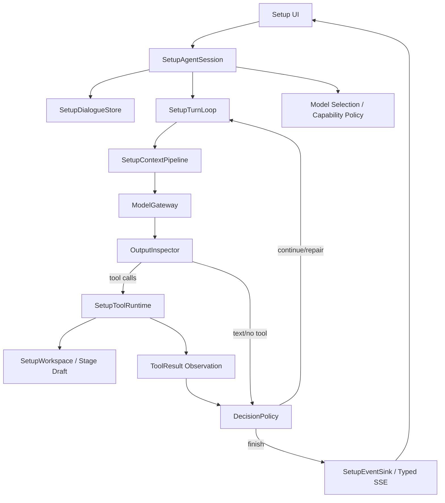

# SetupAgent Optimization Execution Plan

> Task: `.trellis/tasks/05-09-setup-stage-tool-call-recursion-bugfix`
>
> Status: active draft
>
> Owner role: main-brain planner / dispatcher / integrator.

## 1. Role

This document governs execution discipline for the SetupAgent architecture optimization task. It is not a replacement for executable specs under `.trellis/spec/backend/`.

Current task theme:

> Make SetupAgent a robust creative-agent loop reference implementation, so setup can reliably manage stage drafts, tools, context, repair, and visible events, and later story runtime can reuse the same agent runtime primitives.

Hard exclusions:

- Do not modify runtime-story-dev Q documents.
- Do not modify Q acceptance tests.
- Do not modify runtime-story implementation as part of this task.
- Main brain does not directly edit runtime/backend/frontend implementation code or tests; implementation is delegated.

## 2. Authority Order

When instructions conflict:

1. Current user decisions in this task session.
2. Active setup executable specs under `.trellis/spec/backend/` for semantic/runtime contracts.
3. Task-local question queue decisions after they are answered and, when needed, written back to spec.
4. This execution plan for dispatch, module order, check cadence, and engineering discipline.
5. RP redesign setup-agent research/spec docs.
6. Current implementation as migration material.
7. Old setup MVP / longform MVP code as reference only.

This plan can propose contract changes, but it cannot silently override active setup specs. If implementation needs to replace `setup.truth.write` semantics, stage tool scope, draft shape, typed SSE, review/commit/readiness, or persistence boundaries, that must be recorded as an explicit question/decision and then written to the relevant executable spec before implementation proceeds.

## 3. Engineering Method

This task uses **Agent Loop Spine + Contract-First Ports + Deterministic Creative Tools**.

It is not classical DDD. Some domain nouns matter, but the center of gravity is the agent loop:

```text
session
  -> context pipeline
  -> model gateway
  -> output inspection
  -> tool runtime
  -> observation
  -> repair / continue / stop policy
  -> event transcript
```

Reference roles:

- `pi-mono-python`: minimal mature structure. Use it to keep the core spine small: `AgentSession` owns lifecycle, `Agent` owns state/events, `agent_loop` owns model-tool continuation.
- `how-claude-code-works-main`: production behavior reference. Use it for loop recovery, tool lifecycle, context engineering, skills, transcript and event separation.
- `claude-code-from-scratch-main`: runnable minimal code reference. Use it to understand the simplest workable code paths before adding project-specific complexity.
- Current chatboxapp setup specs/code: project contract source.

## 4. Non-Negotiable Design Rules

1. LangGraph is allowed as execution substrate if it reduces work, but graph node names do not define the architecture. The product architecture must be explicit above LangGraph.
2. Visible assistant text, visible tool events, runtime-private cognition, and persisted workspace truth are separate records.
3. Tool errors are observations for the next loop step when recoverable. They should not immediately become final user-facing failure text unless the repair budget/policy says so.
4. Pseudo tool text such as `tool_code print(...)` is not a successful assistant answer. It is either filtered as internal leakage or converted into a repair/failure path depending on context.
5. LLM supplies semantic content and intent; deterministic tool code owns IDs, shape, validation, merge, delta tracking, metadata normalization, and persistence.
6. Setup stage draft structure is retrieval-coupled. It is not arbitrary UI state.
7. Stage tool scope should be small and stage-aware. The unified draft CRUD core should be exposed through stage-local SkillPack/prompt packaging; conflicting legacy tools may be retired after the new tool set proves stable in tests.
8. Provider compatibility is handled by gateway/capability policy and request normalization, not by model-specific prompt folklore.
9. `SetupWorkspace`, review, commit, readiness, typed SSE, and frozen contracts remain protected unless an explicit spec update changes them.

## 5. Current Architecture Gaps

The current implementation already has useful pieces, but the boundaries are blurred:

| Area | Current shape | Gap |
| --- | --- | --- |
| Outer graph | `setup_graph_runner.py` / `setup_graph_nodes.py` wrap load/run/finalize | Thin shell is good, but checkpoint/thread behavior must not create stale recursion loops. |
| Execution service | `setup_agent_execution_service.py` assembles context and calls runtime adapter | Session lifecycle, visible dialogue persistence, model selection, and stream boundary are not cleanly separated as first-class ports. |
| Runtime executor | `agent_runtime/executor.py` has many LangGraph nodes for goal, planning, request, tool execution, assess, reflect, finalize | The node list is rich but not simple enough as the primary mental model; repair/stop/continue semantics need a clearer loop contract. |
| Tool scope | `profiles.py`, `setup_tool_provider.py`, draft CRUD core, stage-local SkillPack exposure | Need to converge on one unified draft CRUD contract and retire legacy write paths after validation. |
| Prompt | `setup_agent_prompt_service.py` mixes global role, stage overlay, truth write hints, skill pack hints, context JSON | Needs to follow context pipeline contract: stable base prompt, stage overlay, skill pack, runtime obligations, tool descriptions each with clear role. |
| Error handling | Tool validation failures and provider failures exist, but repair can terminate early or loop poorly | Need recoverable error withholding/repair behavior similar to Claude Code, with bounded attempts and explicit stop reasons. |
| Events | typed SSE/tool traces exist | Must keep internal tool/pseudo-code/debug traces out of ordinary assistant content while preserving typed tool event display. |

## 6. Target Architecture



### 6.1 Layers

| Layer | Owns | Must not own |
| --- | --- | --- |
| `SetupAgentSession` | user turn lifecycle, cancellation, model selection, transcript boundary, stream boundary | draft mutation details |
| `SetupDialogueStore` | visible user/assistant/tool-event transcript persistence | runtime-private cognition or workspace truth |
| `SetupTurnLoop` | model-tool-observation loop and turn budget | provider schema quirks or draft business rules |
| `SetupContextPipeline` | context packet, governed history, stage overlay, skill pack injection, runtime obligations | tool execution |
| `ModelGateway` | provider request/response normalization, tool-call capability, thinking compatibility | business decisions |
| `OutputInspector` | distinguish real tool calls, assistant text, pseudo tool text, provider errors | tool side effects |
| `SetupToolRuntime` | validation, permission/scope, execution, deterministic observations | prompting |
| `DecisionPolicy` | continue/repair/ask/fail/finish, retry budget, graph stop reason | provider transport |
| `SetupEventSink` | typed SSE, trace mapping, UI-visible/internal separation | workspace mutation |

### 6.2 Turn Loop Contract

```text
receive user turn
  -> load session/workspace state
  -> build context
  -> call model with current tool scope
  -> inspect output
  -> if real tool calls: execute tools and append observations
  -> classify result/failure
  -> if recoverable: continue with repair obligation
  -> if no tool and completion guard allows: finish turn
  -> if repeated no-progress: fail with bounded diagnostic
```

Allowed terminal cases:

- `finish_text`: no unresolved obligation and visible text is acceptable.
- `finish_tool_success`: tool result updated workspace and a final assistant summary is allowed or not required by stream contract.
- `ask_user`: current state requires user input.
- `fail_unrecoverable`: provider/tool/runtime failure cannot be repaired.
- `fail_retry_budget`: same recoverable class exhausted budget.
- `fail_no_progress`: loop made no meaningful progress across bounded iterations.

Disallowed terminal cases:

- pseudo tool text delivered as normal assistant content when a tool call was required.
- recoverable validation error shown as final explanation before repair budget is used.
- successful tool result followed by graph recursion until `GRAPH_RECURSION_LIMIT`.

## 7. Module Plan

Status marks: `[ ]` not started, `[>]` in progress, `[x]` complete, `[!]` blocked/question.

### Phase 0: Planning / Spec Anchor

- `[>]` 0.1 Update task-local execution plan, question queue, architecture spec, and gap analysis.
- Owned files:
  - `.trellis/tasks/05-09-setup-stage-tool-call-recursion-bugfix/research/*`
- Forbidden files:
  - runtime-story-dev task docs/tests/implementation
  - backend/frontend implementation
- Check:
  - task-local docs do not override active specs silently
  - open contract changes are in question queue

### Phase A: Agent Architecture Spine

- `[ ]` A1. Refactor/clarify SetupAgent loop spine boundaries.
- Goal:
  - Make session, context, model gateway, output inspector, tool runtime, decision policy, and event sink explicit enough to test and reason about.
- Expected owned responsibility:
  - setup agent runtime/service/graph boundary files only, assigned to one dev subagent.
- Must preserve:
  - typed SSE
  - `SetupWorkspace`
  - review/commit/readiness semantics
  - current frozen setup contracts
- Acceptance:
  - pseudo tool text cannot finish a tool-required turn
  - successful tool result has deterministic stop/next route
  - recoverable tool/provider errors create repair observations up to bounded budget

### Phase B: Unified Draft CRUD Contract

- `[>]` B1. Converge on one shared draft CRUD core and retire legacy setup write paths after validation.
- Target:
  - one reusable draft CRUD service for all stages
  - stage-local SkillPack/prompt pack decides which subset/overrides are surfaced
  - LLM supplies semantic content and operation intent; code owns entry shape, ids, schema normalization, merge/delete, metadata normalization, and retrieval-friendly persistence
- Check focus:
  - same CRUD core works across stage families
  - stage-local exposure remains small and deterministic
  - legacy write tools are hidden/retired only after new tool-set tests pass

### Phase C: Provider Compatibility / Tool Call Robustness

- `[ ]` C1. Provider capability policy and request normalization.
- Goal:
  - Most OpenAI-compatible providers should either use real tool calls correctly or fail with classified capability errors.
- Acceptance:
  - provider/gateway failure, model no-tool-call behavior, schema validation failure, and loop failure are separately reported
  - DeepSeek and one Gemini-compatible channel can be live-smoked when credentials are available

### Phase D: Setup Dialogue Persistence

- `[ ]` D1. Persist visible setup dialogue.
- Status:
  - deferred unless it becomes necessary for architecture-spine tests.
- Boundary:
  - visible transcript only; runtime cognition stays private.

### Phase E: Setup Model Config Sync

- `[ ]` E1. Setup model page syncs with shared model registry.
- Status:
  - deferred from current architecture-spine slice.

### Phase F: SkillPack Governance

- `[ ]` F1. Keep SkillPack as stage-local prompt pack, not tool scope owner.
- Current spec anchor:
  - character_design demo exists.
  - expanding every stage to have skills is future work.
- Acceptance:
  - skill pack prompt is stage-local
  - hard unload between stages
  - no silent switch of pilot stage without spec update

## 8. Subagent Dispatch Rules

1. At most 2 subagents may run concurrently.
2. Development subagent:
   - `agent_type = default`
   - `model = gpt-5.5`
   - `reasoning_effort = high`
   - prompt must instruct trellis-implement behavior.
3. Check subagent:
   - `agent_type = default`
   - `model = gpt-5.5`
   - `reasoning_effort = xhigh`
   - prompt must instruct trellis-check behavior.
4. Same module consecutive slices stay with the same dev subagent.
5. `trellis-check` is module-level by default.
6. Main brain must define module boundary, owned files/responsibility, forbidden files, specs, tests, and validation commands before dispatch.
7. Subagents must escalate real unresolved requirement/design questions to the question queue; they must not invent new口径.

## 9. Verification Matrix

| Risk | Required verification |
| --- | --- |
| pseudo tool text leak | runtime executor/output inspector test: pseudo `tool_code` is not emitted as ordinary assistant content when action expectation requires tool use |
| weak repair loop | validation failure test: one bad tool payload creates repair observation and retry, repeated same class stops with retry-budget reason |
| recursion/no stop | tool success route test: `discussion.update_state` / draft write result reaches deterministic finish/next route under bounded graph config |
| tool contract drift | tool scope/schema snapshot tests for current stage |
| typed SSE regression | stream tests assert tool start/result events remain typed and visible, while internal debug text is not assistant content |
| provider mismatch | mocked provider tests plus opt-in live smoke for configured OpenAI-compatible channels |
| runtime-story contamination | `git diff --name-only` review confirms no runtime-story Q docs/tests/implementation were modified by this task |

## 10. References

Task-local:

- `setup-agent-architecture-spine-spec.md`
- `setup-agent-current-gap-analysis.md`
- `setup-agent-optimization-question-queue.md`

Active setup specs:

- `.trellis/spec/backend/rp-setup-agent-loop-semantics-react-trace.md`
- `.trellis/spec/backend/rp-setup-agent-structured-output-schema-repair.md`
- `.trellis/spec/backend/rp-setup-agent-stage-aware-tool-scope.md`
- `.trellis/spec/backend/rp-setup-agent-stage-skill-pack.md`
- `.trellis/spec/backend/rp-setup-agent-pre-model-context-assembly.md`
- `.trellis/spec/backend/rp-setup-agent-stage-local-context-governance.md`
- `.trellis/spec/backend/rp-setup-agent-execution-service-outer-harness-thin-boundary.md`
- `.trellis/spec/backend/rp-setup-agent-strict-truth-write-tool-pilot.md`

Research references:

- `H:/Agent-Learn/pi-mono-python`
- `docs/research/how-claude-code-works-main/docs`
- `docs/research/claude-code-from-scratch-main`
