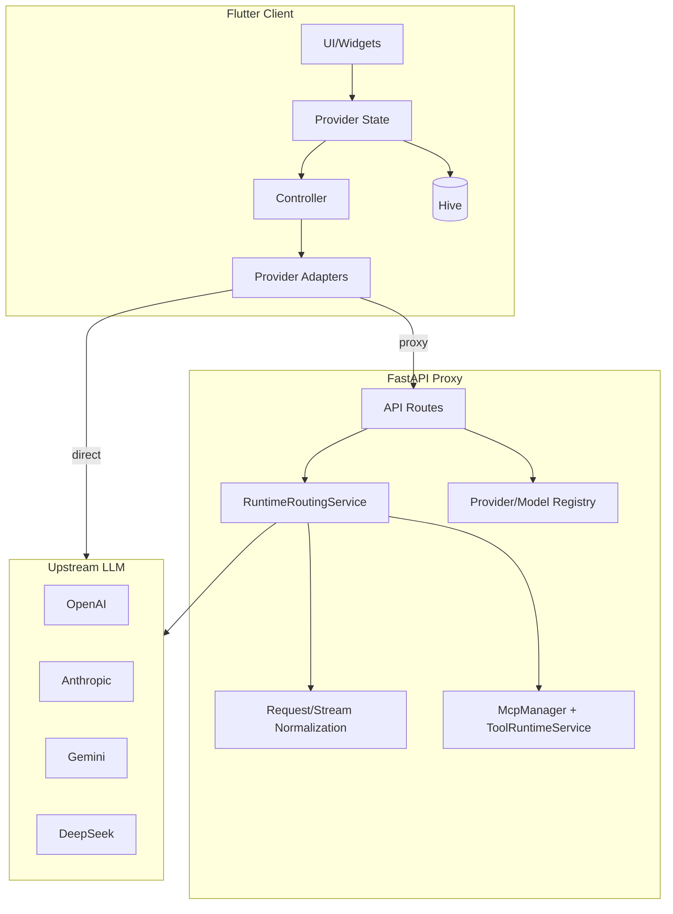
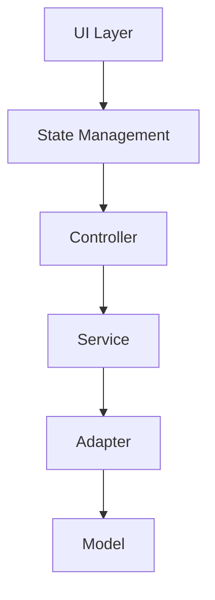
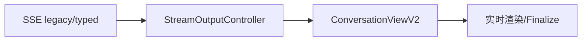
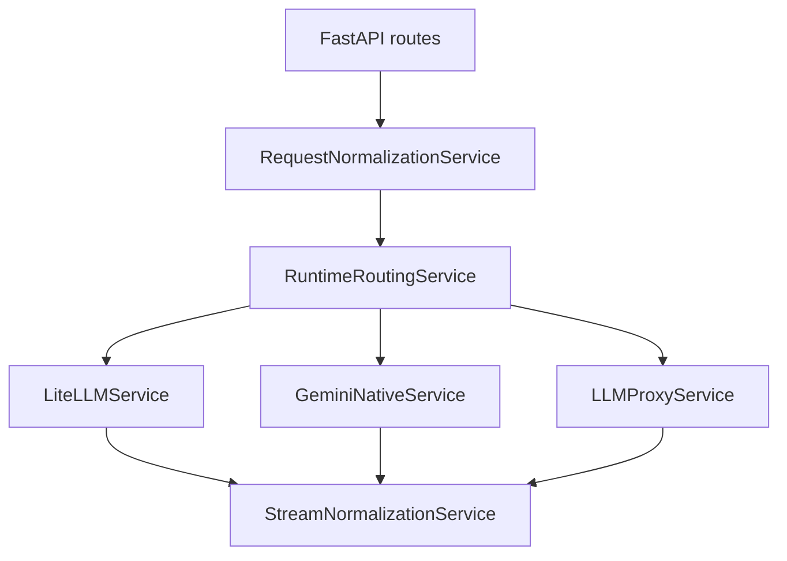
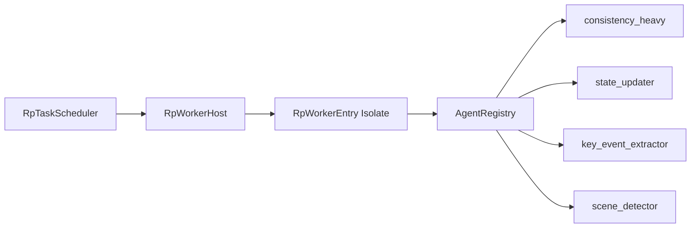
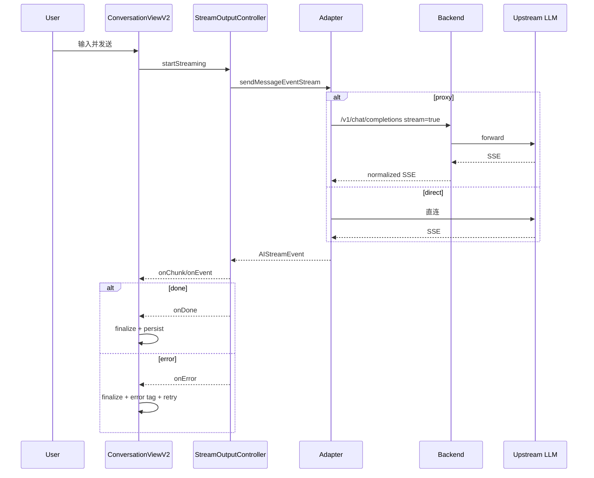
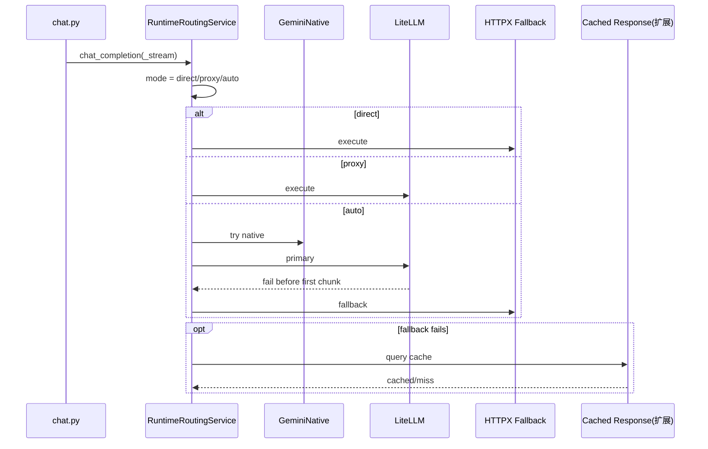
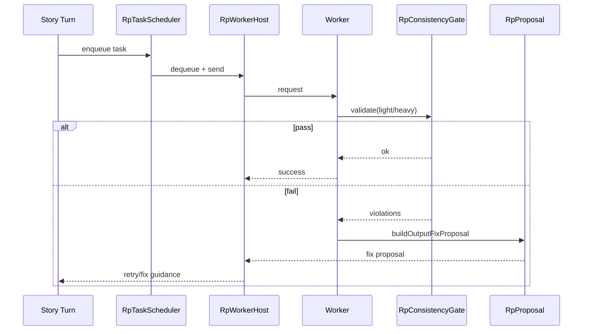
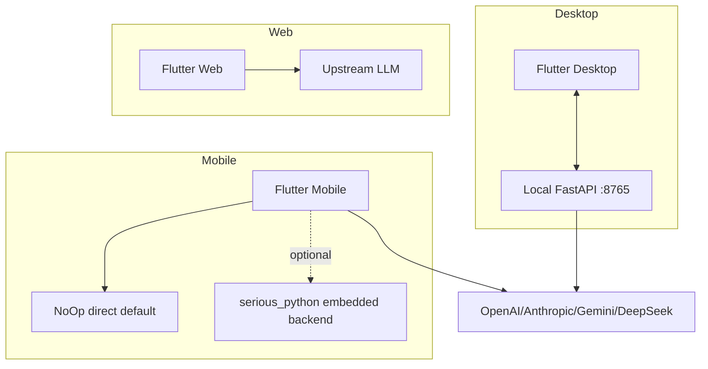
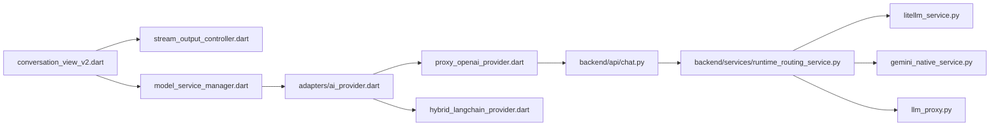

# ChatBoxApp 架构设计文档（Architecture Design Document）

> 栈：Flutter（Dart）+ Python FastAPI  
> 平台：Android、iOS、Windows、macOS、Linux、Web  
> 目标：多 LLM Provider 的 AI 对话与 RP（角色扮演）能力

## 0. 路径映射（需求示例 → 仓库真实路径）

- `lib/services/ai_provider.dart` → `lib/adapters/ai_provider.dart`
- `backend/services/runtime_router.py` → `backend/services/runtime_routing_service.py`
- `backend/utils/stream_normalization.py` → `backend/services/stream_normalization.py`
- `lib/ui/owui/components/` → `lib/chat_ui/owui/components/`
- `lib/services/rp/context_compiler.dart` → `lib/services/roleplay/context_compiler/rp_context_compiler.dart`

---

## 1. 系统总体架构（System Overview）

### 1.1 系统边界

内部可控：Flutter 客户端、Python 后端代理、RP 子系统。  
外部依赖：OpenAI、Anthropic、Gemini、DeepSeek 等上游 API。

### 1.2 三层拓扑



### 1.3 三种后端路由模式

定义：`lib/models/backend_mode.dart`

```dart
enum BackendMode { direct, proxy, auto }
```

| 模式 | 行为 | 场景 | 切换条件 |
|---|---|---|---|
| `direct` | 客户端直连 LLM | Web/无后端代理 | `python_backend_enabled=false` |
| `proxy` | 统一走 FastAPI | 统一审计、工具、附件处理 | `python_backend_enabled=true` 主路径 |
| `auto` | 优先代理，失败回退 | 提升可用性 | `backend_mode=auto` + fallback/circuit breaker |

实现口径：

- 前端工厂：`lib/adapters/ai_provider.dart`（当前过渡态偏 `ProxyOpenAIProvider`）
- 客户端 auto 组件：`lib/adapters/backend_routing_provider.dart`
- 后端路由决策：`backend/services/runtime_routing_service.py`

---

## 2. Flutter 客户端架构（Client Architecture）

### 2.1 分层依赖（单向）



### 2.2 Provider 抽象层

接口：`lib/adapters/ai_provider.dart`

```dart
abstract class AIProvider {
  Future<ProviderTestResult> testConnection();
  Future<List<String>> listAvailableModels();
  Stream<String> sendMessageStream({ ... });
  Stream<AIStreamEvent> sendMessageEventStream({ ... }) async* { ... }
  Future<String> sendMessage({ ... });
}
```

实现与职责：

- `OpenAIProvider`：OpenAI-compatible 直连（`lib/adapters/openai_provider.dart`）
- `LangChainProvider`：LangChain 调用链（`lib/adapters/langchain_provider.dart`）
- `ProxyOpenAIProvider`：代理路由 + typed SSE（`lib/adapters/proxy_openai_provider.dart`）
- `HybridLangChainProvider`：LangChain + SSE + MCP（`lib/adapters/hybrid_langchain_provider.dart`）

### 2.3 流式输出管道



关键路径：

- `lib/controllers/stream_output_controller.dart`
- `lib/widgets/conversation_view_v2/streaming.dart`

关键片段：

```dart
await _streamController.startStreaming(
  provider: provider,
  onChunk: (chunk) => _chunkBuffer?.add(chunk),
  onEvent: (event) => _handleStreamEvent(event),
  onDone: () { _pendingFinalize = (...); },
  onError: (error) { _pendingFinalize = (...error: error...); },
);
```

错误与重连策略：

- 统一 finalize，避免丢失已生成内容
- `_stopStreaming()` 尝试 cancel 当前请求
- 回退仅允许发生在“尚未输出 chunk”阶段（避免重复响应）

### 2.4 对话存储层（Hive）

主服务：`lib/services/hive_conversation_service.dart`，核心 Box：

- `conversations`
- `messages`
- `settings`

TypeId 规范：

- 核心（0-49）：当前使用 0-3
  - `Conversation`=0（`lib/models/conversation.dart`）
  - `Message`=1（`lib/models/message.dart`）
  - `FileType`=2 / `AttachedFileSnapshot`=3（`lib/models/attached_file.dart`）
- RP（50-59）：`lib/models/roleplay/`

RP Box（`lib/services/roleplay/rp_memory_repository.dart`）：`rp_story_meta`、`rp_entry_blobs`、`rp_ops`、`rp_snapshots`、`rp_proposals`。

### 2.5 OpenWebUI 兼容设计系统

- Token：`lib/chat_ui/owui/owui_tokens.dart`
- Palette：`lib/chat_ui/owui/palette.dart`
- 组件：`lib/chat_ui/owui/components/`

### 2.6 MCP 集成

- 客户端入口：`lib/services/mcp_client_service.dart`
- Provider 适配：`lib/adapters/mcp_tool_adapter.dart`

```dart
class McpToolAdapter {
  List<Map<String, dynamic>> getToolDefinitions();
  Future<ToolExecutionResult> executeTool({required String name, required Map<String, dynamic> arguments});
}
```

`ConversationViewV2` 在满足“模型支持工具 + MCP 已连接”时注入 `McpToolAdapter`。

---

## 3. Python 后端架构（Backend Architecture）

### 3.1 请求处理流程



入口：`backend/main.py`；路由汇总：`backend/api/__init__.py`；聊天路由：`backend/api/chat.py`。

### 3.2 双路径接入

- 路径一（统一接入）：`backend/services/litellm_service.py`
- 路径二（Gemini 原生）：`backend/services/gemini_native_service.py`
- 兜底路径（httpx）：`backend/services/llm_proxy.py`

路由核心：`backend/services/runtime_routing_service.py`

```python
class RuntimeRoutingService:
    async def chat_completion(self, request: ChatCompletionRequest): ...
    async def chat_completion_stream(self, request: ChatCompletionRequest): ...
    def _get_route_mode(self, request: ChatCompletionRequest) -> str: ...
```

非流与流式均遵循 `direct/proxy/auto`。

### 3.3 SSE 归一化

文件：`backend/services/stream_normalization.py`

```python
class StreamNormalizationService:
    def extract_events(self, chunk): ...
    def emit_compatible_chunks(self, events, *, template=None): ...
    def emit_typed_payloads(self, events): ...
    @staticmethod
    def build_done_payload() -> dict[str, str]:
        return {"type": "done"}
```

归一目标：把 `choices[].delta`（OpenAI/LiteLLM）与 `candidates[].parts`（Gemini）转换为统一前端消费格式。

### 3.4 Provider Registry

- API：`backend/api/providers.py`、`backend/api/provider_models.py`
- 服务：`backend/services/provider_registry.py`、`backend/services/model_registry.py`
- 能力：`backend/services/model_capability_service.py`

机制：动态 upsert provider/model；按 `provider_id/model_id + capability + backend_mode` 分派。

### 3.5 附件处理

文件：`backend/services/attachment_message_service.py`

- 图片转 data URL 多模态 part
- 文档抽取并并入 user message
- 支持 base64 远程内容与本地 path

---

## 4. 角色扮演子系统架构（RP Subsystem）

### 4.1 隔离命名空间

- `rp_*` 前缀 box
- TypeId 50-59 独立段
- 存储入口：`lib/services/roleplay/rp_memory_repository.dart`

当前 box：`rp_story_meta`、`rp_entry_blobs`、`rp_ops`、`rp_snapshots`、`rp_proposals`。  
扩展命名规范可覆盖 `rp_characters`、`rp_scenarios`。

### 4.2 Context Compiler 与 Budget Broker

- `RpContextCompiler`：`lib/services/roleplay/context_compiler/rp_context_compiler.dart`
- `RpBudgetBroker`：`lib/services/roleplay/context_compiler/rp_budget_broker.dart`

```dart
final broker = RpBudgetBroker(config: RpBudgetConfig(maxTokensTotal: maxTokensTotal));
final packed = broker.pack(allCandidates);
final hasP0Overflow = broker.hasP0Overflow(packed);
```

Fragment 语义：System Prompt + Character Card + Chat History + World Info（分别由会话系统提示、角色/场景模块与上下文窗口组装）。

### 4.3 Consistency Gate

核心：`lib/services/roleplay/consistency_gate/rp_consistency_gate.dart`

- light/heavy validator 管道
- 降级策略（阈值提升、暂时禁用）
- 失败输出：`RpProposal(output_fix)`，进入修复/重试

### 4.4 Worker/Agent 异步调度



关键文件：

- `lib/services/roleplay/worker/rp_task_scheduler.dart`
- `lib/services/roleplay/worker/rp_worker_host.dart`
- `lib/services/roleplay/worker/rp_worker_entry.dart`
- `lib/services/roleplay/worker/agents/agent_registry.dart`

### 4.5 记忆仓库与版本管理

- 前端：`rp_ops + rp_snapshots`（日志 + 快照）
- 后端版本读：`backend/rp/services/version_history_read_service.py`
- Core State Store：
  - `backend/rp/services/core_state_store_repository.py`
  - `backend/models/rp_core_state_store.py`
- checkpoint：`backend/services/langgraph_checkpoint_store.py`

---

## 5. 关键数据流（Critical Data Flows）

### 5.1 用户发送消息 → 流式响应全链路



### 5.2 后端路由决策与熔断回退



熔断状态机：`Closed -> Open -> Half-Open`（`lib/services/circuit_breaker_service.dart`）。

### 5.3 RP 一致性检验异步流程



---

## 6. 部署拓扑（Deployment Topology）

### 6.1 桌面端

- Flutter Desktop + 本地后端进程
- `DesktopBackendLifecycle` 负责启动/健康检查/重启
- IPC：`127.0.0.1:8765`（HTTP）

### 6.2 移动端

- 默认：`NoOpBackendLifecycle`（direct）
- 可选：`MobileBackendLifecycle` + `serious_python` 运行 `assets/backend/app.zip`

### 6.3 Web 端

- 纯 Flutter Web（JS）
- 无本地代理，direct 调上游 API
- 需处理 CORS 与 key 安全



---

## 7. 附录

### 7.1 ADR（关键决策）

| ADR | 决策 | 权衡 |
|---|---|---|
| ADR-01 | `AIProvider` 抽象统一多 Provider | 扩展性更强，适配层复杂度上升 |
| ADR-02 | typed SSE 作为结构化流标准 | 事件语义更清晰，双端升级成本增加 |
| ADR-03 | `RuntimeRoutingService` 统一路由策略 | 可控性提升，路由逻辑更复杂 |
| ADR-04 | RP 独立命名空间与 TypeId 50-59 | 强隔离，迁移设计要求更高 |

### 7.2 主要模块依赖关系图



### 7.3 性能指标目标

| 指标 | 目标 |
|---|---|
| 首包延迟（TTFB） | P50 < 1.2s，P95 < 2.5s |
| 流式吞吐 | P50 > 20 token/s |
| auto 回退成功率 | > 99%（首包前） |
