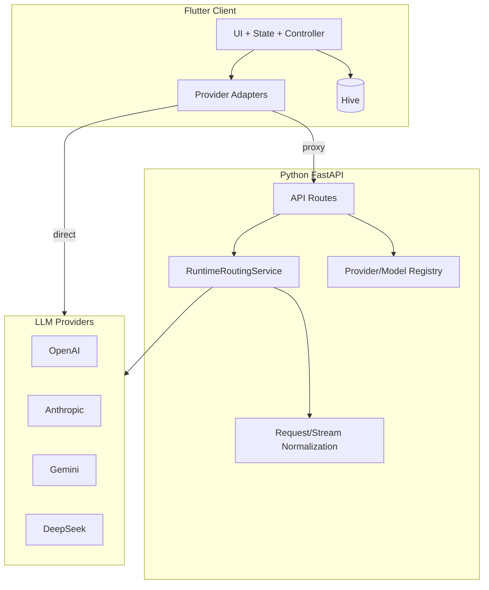
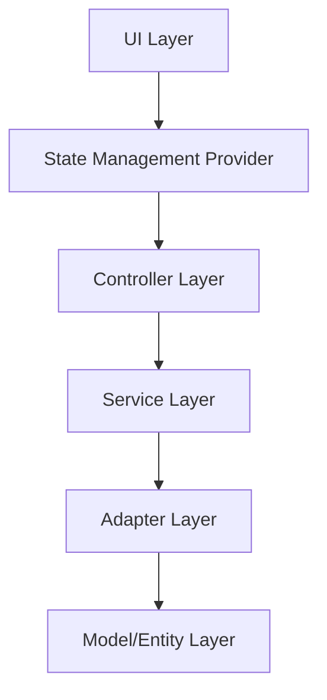
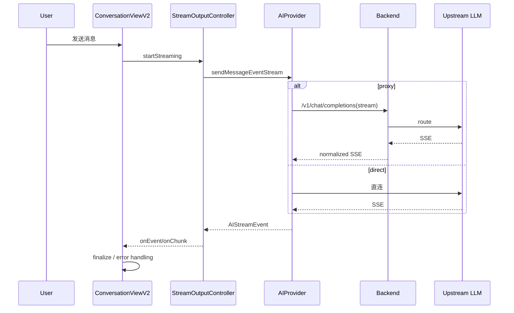
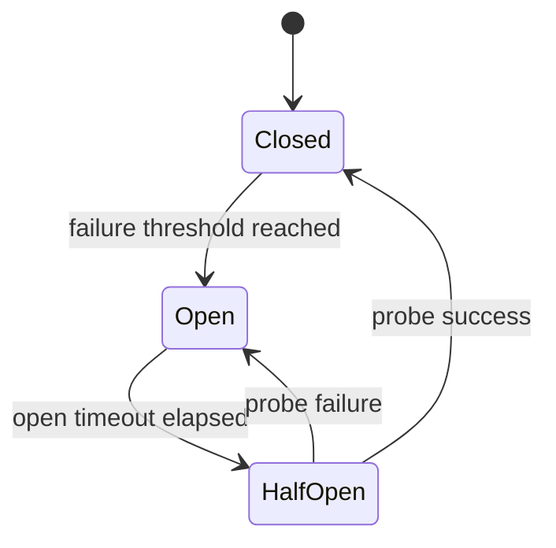
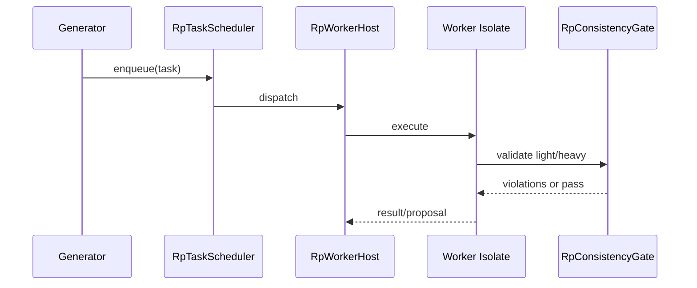

# ChatBoxApp 概要设计说明书（HLD）

## 1. 文档概述

### 1.1 编写目的

本文档用于指导 ChatBoxApp 的研发、评审与迭代实施，明确系统边界、模块职责、关键流程、非功能目标和交付验收口径。

### 1.2 读者对象

- 架构师 / 后端工程师 / Flutter 客户端工程师
- 测试工程师 / 运维工程师
- 新加入项目成员

### 1.3 术语

- `LLM`：大语言模型服务
- `SSE`：Server-Sent Events
- `MCP`：Model Context Protocol
- `RP`：Roleplay（角色扮演）子系统

---

## 2. 背景与目标

### 2.1 背景

ChatBoxApp 是一个跨平台 AI 对话应用，核心是“多 Provider 接入 + 流式响应 + RP 场景增强 + 工具调用能力”。

### 2.2 建设目标

- 在一个客户端内统一接入 OpenAI / Anthropic / Gemini / DeepSeek 等模型
- 支持 `direct/proxy/auto` 路由模式和可回退链路
- 提供稳定的流式输出体验（含 typed SSE）
- 提供 RP 上下文编译、一致性检验、异步 Agent 调度能力

### 2.3 范围边界

In Scope：

- Flutter 客户端分层架构
- FastAPI 代理与路由治理
- RP 子系统（context/compiler/gate/worker）
- 部署与运维方案（桌面/移动/Web）

Out of Scope：

- 商业化计费系统
- 多租户权限中心
- 云端统一运营后台

---

## 3. 总体架构设计

### 3.1 系统上下文



### 3.2 分层架构



### 3.3 路由模式设计

定义文件：`lib/models/backend_mode.dart`

```dart
enum BackendMode { direct, proxy, auto }
```

- `direct`：客户端直连上游 API
- `proxy`：强制走 FastAPI 后端
- `auto`：优先代理，失败回退

关键实现锚点：

- 客户端路由入口：`lib/adapters/ai_provider.dart`（`ProviderFactory.createProviderWithRouting`）
- 自动回退组件：`lib/adapters/backend_routing_provider.dart`（`BackendRoutingProvider`）
- 后端路由核心：`backend/services/runtime_routing_service.py`（`RuntimeRoutingService`）

---

## 4. 模块设计

### 4.1 客户端核心模块

1. Provider 抽象层
- 文件：`lib/adapters/ai_provider.dart`
- 核心类：`AIProvider`
- 实现：`OpenAIProvider`、`LangChainProvider`、`ProxyOpenAIProvider`、`HybridLangChainProvider`

2. 流式控制层
- 文件：`lib/controllers/stream_output_controller.dart`
- 核心类：`StreamOutputController`
- 职责：流监听、取消、完成/异常回调

3. 对话主视图
- 文件：`lib/widgets/conversation_view_v2/streaming.dart`
- 职责：发送消息、处理 typed SSE、finalize 落盘

4. 存储层
- 文件：`lib/services/hive_conversation_service.dart`
- Box：`conversations`、`messages`、`settings`

### 4.2 后端核心模块

1. API 网关
- 文件：`backend/api/chat.py`
- 路由：`/v1/chat/completions`、`/v1/embeddings`、`/v1/rerank`

2. 运行时路由
- 文件：`backend/services/runtime_routing_service.py`
- 类：`RuntimeRoutingService`
- 职责：`direct/proxy/auto` 选择与 fallback

3. 执行服务
- `backend/services/litellm_service.py`（多 Provider 统一接入）
- `backend/services/gemini_native_service.py`（Gemini 官方 SDK 路径）
- `backend/services/llm_proxy.py`（httpx fallback）

4. 归一化
- `backend/services/request_normalization.py`
- `backend/services/stream_normalization.py`

5. Registry
- `backend/services/provider_registry.py`
- `backend/services/model_registry.py`
- `backend/services/model_capability_service.py`

### 4.3 RP 子系统模块

1. 上下文编译
- `lib/services/roleplay/context_compiler/rp_context_compiler.dart`
- 核心类：`RpContextCompiler`

2. Token 预算
- `lib/services/roleplay/context_compiler/rp_budget_broker.dart`
- 核心类：`RpBudgetBroker`

3. 一致性闸门
- `lib/services/roleplay/consistency_gate/rp_consistency_gate.dart`
- 核心类：`RpConsistencyGate`

4. 异步 Worker
- `lib/services/roleplay/worker/rp_task_scheduler.dart`（`RpTaskScheduler`）
- `lib/services/roleplay/worker/rp_worker_host.dart`（`RpWorkerHost`）
- `lib/services/roleplay/worker/agents/agent_registry.dart`（`AgentRegistry`）

---

## 5. 数据与存储设计

### 5.1 客户端数据模型（Hive）

- `Conversation`：`lib/models/conversation.dart`，typeId=0
- `Message`：`lib/models/message.dart`，typeId=1
- `FileType` / `AttachedFileSnapshot`：`lib/models/attached_file.dart`，typeId=2/3

TypeId 规划：

- 核心：0-49（当前使用 0-3）
- RP：50-59（`lib/models/roleplay/`）

### 5.2 RP 数据隔离

RP Box（`lib/services/roleplay/rp_memory_repository.dart`）：

- `rp_story_meta`
- `rp_entry_blobs`
- `rp_ops`
- `rp_snapshots`
- `rp_proposals`

### 5.3 后端权威存储

- Core State Store 仓储：`backend/rp/services/core_state_store_repository.py`
- Core State 模型：`backend/models/rp_core_state_store.py`
- 版本读取：`backend/rp/services/version_history_read_service.py`
- Checkpoint schema：`backend/services/langgraph_checkpoint_store.py`

---

## 6. 接口设计

### 6.1 对外 API（后端）

- `POST /v1/chat/completions`
- `POST /v1/embeddings`
- `POST /v1/rerank`
- `GET /models` / `GET /v1/models`

关键代码锚点：`backend/api/chat.py`

```python
@router.post("/v1/chat/completions")
async def chat_completions(request: Request):
    chat_request = ChatCompletionRequest(**body)
    service = _get_llm_service()
    if chat_request.stream:
        return StreamingResponse(..., media_type="text/event-stream")
    return await service.chat_completion(chat_request)
```

### 6.2 关键请求对象

定义：`backend/models/chat.py`

```python
class ChatCompletionRequest(BaseModel):
    model: str
    messages: list[ChatMessage]
    stream: bool = False
    stream_event_mode: Literal["legacy", "typed"] | None = None
    provider_id: str | None = None
    provider: ProviderConfig | None = None
```

### 6.3 客户端关键接口

`AIProvider`（`lib/adapters/ai_provider.dart`）

```dart
Stream<AIStreamEvent> sendMessageEventStream({
  required String model,
  required List<ChatMessage> messages,
  required ModelParameters parameters,
  List<AttachedFileData>? files,
  String? modelId,
});
```

---

## 7. 关键流程设计

### 7.1 消息发送与流式回传



### 7.2 后端路由与熔断回退



说明：

- 客户端：`lib/services/circuit_breaker_service.dart`
- 客户端回退策略：`lib/services/fallback_policy.dart`
- 后端路由决策：`backend/services/runtime_routing_service.py`

### 7.3 RP 一致性异步流程



---

## 8. 非功能设计

### 8.1 性能目标

- 首包延迟：P50 < 1.2s，P95 < 2.5s
- 流式吞吐：P50 > 20 token/s
- auto 回退成功率（首包前）：> 99%

### 8.2 安全

- API Key 存储与传输最小暴露
- 后端 registry 输出脱敏摘要
- 可按环境限制 CORS、来源域名、控制面接口

### 8.3 可用性

- 客户端 circuit breaker + fallback
- 后端 multi-path routing（LiteLLM / Gemini Native / httpx）
- 流中断后可重试并保留错误上下文

### 8.4 可观测性

- 后端 `chat.py` 请求生命周期日志（request_id、provider、model、duration）
- 路由日志（backend_execution_mode、fallback reason）
- Worker 任务 metrics（duration、llm_call_count）

---

## 9. 部署与运维设计

### 9.1 桌面端

- `DesktopBackendLifecycle` 启动本地 FastAPI 子进程
- IPC：`http://127.0.0.1:8765`

文件：`lib/services/backend_lifecycle_desktop.dart`

### 9.2 移动端

- 默认：`NoOpBackendLifecycle`（direct）
- 可选：`MobileBackendLifecycle` + `serious_python`

文件：

- `lib/services/backend_lifecycle_noop.dart`
- `lib/services/backend_lifecycle_mobile.dart`

### 9.3 Web 端

- 纯 Flutter Web（无本地代理）
- 直接访问上游 LLM API
- 重点关注 CORS 与密钥注入策略

---

## 10. 技术决策与权衡（ADR 摘要）

| 决策 | 方案 | 取舍 |
|---|---|---|
| Provider 统一抽象 | `AIProvider` + 多实现 | 可扩展性高，适配成本增加 |
| 流式语义标准化 | typed SSE | 语义清晰，双端升级成本增加 |
| 路由治理 | `RuntimeRoutingService` | 可控与容错提升，复杂度提高 |
| RP 存储隔离 | `rp_*` + TypeId 50-59 | 低耦合，迁移设计要求更高 |

---

## 11. 测试与验收

### 11.1 测试策略

- 单测：路由策略、归一化逻辑、RP 编译与验证器
- 集成：`/v1/chat/completions` 流式链路、fallback 分支
- 端到端：发送消息→流式回传→finalize 持久化

### 11.2 验收标准

- 三种路由模式可按配置生效
- 流式过程中工具/usage 事件可被正确消费
- RP 上下文编译可稳定注入，异常路径可回退
- 关键 API 在异常情况下返回可解析错误对象

---

## 12. 风险与后续计划

主要风险：

- 客户端全局开关策略与 provider-level `backendMode` 并存，可能导致配置理解偏差
- 多路径 fallback 的边界条件复杂，需持续补充回归样例
- RP 双轨存储期（mirror/store）带来读写一致性风险

缓解措施：

- 在设置页和文档中明确“全局开关优先级”
- 为 fallback 首包前后行为建立专门测试集
- 保持 Core State Store 读写切换可观察、可回滚

后续迭代：

1. 将 provider-level routing 与全局开关收敛为单一策略面板
2. 扩展 typed SSE 事件指标上报（客户端+后端统一）
3. 完善 RP 提案闭环（自动修复→复检→提交）